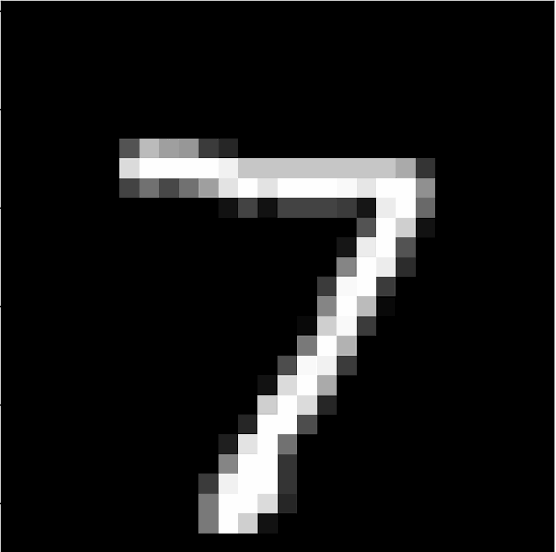

# CNN-Digits-Classifier
A Convolutional Neural Network to classify digits

This notebook is my submission to kaggle's <a href='https://www.kaggle.com/c/digit-recognizer'>Digit Recognizer</a> contest.

The contest is about building a deep learning model to identify the digit in input image.

 is 7

 

The model predicts with an accuracy score of 0.993 on training validation data.

This submission ranks up among **top 28%** on the <a href="https://www.kaggle.com/c/digit-recognizer/leaderboard">leaderboard</a>.
